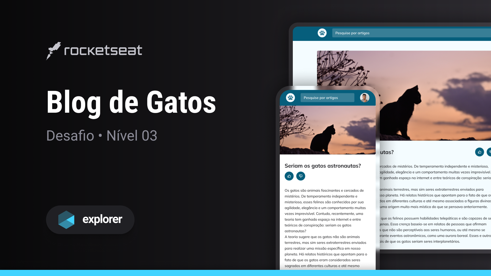

## 💻 Projeto

Esse é um projeto de um Blog sobre gatos.

## 🚀 Tecnologias

Esse projeto foi desenvolvido durante o curso Explorer da Rocketseat com as seguintes tecnologias HTML e CSS:

- Mobile First: projeto iniciado deixando-o responsivo em telas menores para depois ajustar para uma versão desktop;
- Unidade de medida flexível;
- Grid;
- Variáveis no CSS;
- Cores HSL;
- Animações e transições simples.

## 🏷️ Layout

Você pode visualizar o layout do projeto através [desse link](https://www.figma.com/file/AbNZcmeU0lEP7esNVUxq2Z/Blog-de-Gatos-%E2%80%A2-Desafio-Explorer-(Community)?type=design&node-id=101-91&mode=design&t=xGZcakr2smumsJD7-0).
É necessário ter uma conta do [Figma](https://www.figma.com).
